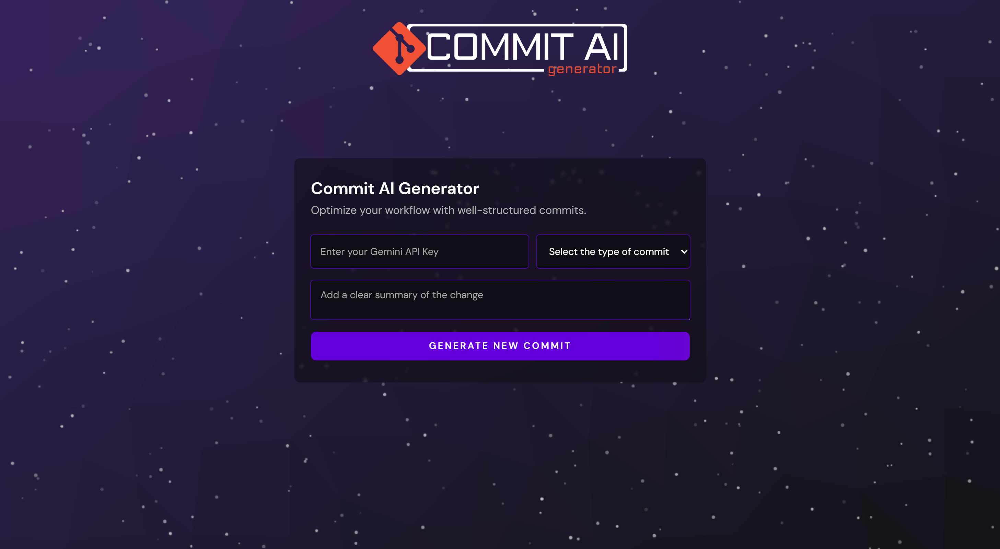

## 🤖 Commit AI Generator
Is an intelligent commit message generator powered by Gemini AI, designed to help developers write clear, standardized messages effortlessly.
YouChoose the type of change you made, and type a short description of your code changes, and it instantly suggests a commit message.
A simple, smart tool to improve your workflow and save time.

---

## 🧪 Technologies  
- HTML  
- CSS  
- JavaScript  
- [ThPace background]
- Google Gemini API  

---

_Commit AI Gen is a project developed during the 20th edition of NLW (Next Level Week), a programming event organized by RocketSeat, aiming to give developers the opportunity to code, learn, and build real projects._
